<div align="center">




<br>

<a href="https://t.me/AbeRion2"></a>


</div>

---

### ▚ whoami

```
> кодю то, что нужно мне самому: утилиты, инструменты, моды
> рисую пиксель-арт и спрайты
> пишу музыку и синтезаторы к ней
> самоучка, без формального бэкграунда
```

- **SS14** - утилиты, спрайты персонажей, внутриигровые инструменты
- **Звук** - свой VST-синт на C++ и JUCE
- **Minecraft** - мод «Зов Пустоты» (1.20.1 Forge)
- **Pixel art** - Aseprite, спрайтовые ракурсы, RSI для SS14

---

### ▚ stack

<div align="center">


</div>

---

### ▚ проекты

| | репозиторий | о чём |
|:--|:--|:--|
| `▲` | **[SpaceStation14_Utility](https://github.com/Sk1rs/SpaceStation14_Utility)** | мультиутилита для SS14 · `C#` |
| `▲` | **[ss14-drum-station](https://github.com/Sk1rs/ss14-drum-station)** | полноценная барабанная установка внутри SS14 · `C#` |
| `▲` | **[synthwavesynth](https://github.com/Sk1rs/synthwavesynth)** | простой синтезатор на JUCE + VST3 SDK · `C++` |
| `▲` | **[ChocStationFiles](https://github.com/Sk1rs/ChocStationFiles)** | файлы станции · `Fluent` |

---

### ▚ статистика

<div align="center">


<br><br>


</div>

---

<div align="center">

```
△ ▽ △ ▽ △ ▽ △ ▽ △ ▽ △ ▽ △ ▽ △
```

<sub>тихо делаю свои штуки</sub>

</div>
